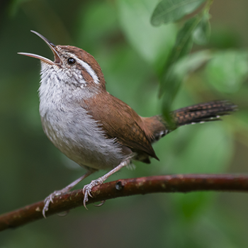

# Cornell Birdcall Identification

Kaggle compitition: https://www.kaggle.com/c/birdsong-recognition

Do you hear the birds chirping outside your window? Over 10,000 bird species occur in the world, and they can be found in nearly every environment, from untouched rainforests to suburbs and even cities. Birds play an essential role in nature. They are high up in the food chain and integrate changes occurring at lower levels. As such, birds are excellent indicators of deteriorating habitat quality and environmental pollution. However, it is often easier to hear birds than see them. With proper sound detection and classification, researchers could automatically intuit factors about an area’s quality of life based on a changing bird population.

There are already many projects underway to extensively monitor birds by continuously recording natural soundscapes over long periods. However, as many living and nonliving things make noise, the analysis of these datasets is often done manually by domain experts. These analyses are painstakingly slow, and results are often incomplete. Data science may be able to assist, so researchers have turned to large crowdsourced databases of focal recordings of birds to train AI models. Unfortunately, there is a domain mismatch between the training data (short recording of individual birds) and the soundscape recordings (long recordings with often multiple species calling at the same time) used in monitoring applications. This is one of the reasons why the performance of the currently used AI models has been subpar.

To unlock the full potential of these extensive and information-rich sound archives, researchers need good machine listeners to reliably extract as much information as possible to aid data-driven conservation.

The [Cornell Lab of Ornithology’s Center for Conservation Bioacoustics](https://www.birds.cornell.edu/ccb/) (CCB)’s mission is to collect and interpret sounds in nature. The CCB develops innovative conservation technologies to inspire and inform the conservation of wildlife and habitats globally. By partnering with the data science community, the CCB hopes to further its mission and improve the accuracy of soundscape analyses.

In this competition, you will identify a wide variety of bird vocalizations in soundscape recordings. Due to the complexity of the recordings, they contain weak labels. There might be anthropogenic sounds (e.g., airplane overflights) or other bird and non-bird (e.g., chipmunk) calls in the background, with a particular labeled bird species in the foreground. Bring your new ideas to build effective detectors and classifiers for analyzing complex soundscape recordings!

If successful, your work will help researchers better understand changes in habitat quality, levels of pollution, and the effectiveness of restoration efforts. Reliable machine listeners would also allow conservationists to deploy more recording units worldwide and would enable data-driven conservation at a scale not yet possible. The eventual conservation outcomes could greatly improve the quality of life for many living organisms—birds and human beings included.

### Project Goal
Your challenge in this competition is to identify which birds are calling in long recordings, given training data generated in meaningfully different contexts. This is the exact problem facing scientists trying to automate the remote monitoring of bird populations.

### The Data
The data is represnted in a number of files 
**test.csv** 
Only the first three rows are available for download; the full test.csv is in the hidden test set.
- site: Site ID.
- row_id: ID code for the row.
- seconds: the second ending the time window, if any. Site 3 time windows cover the entire audio file and have null entries for seconds.
- audio_id: ID code for the audio file.

**example_test_audio_metadata.csv** 
Complete metadata for the example test audio. These labels have higher time precision than is used for the hidden test set.

**example_test_audio_summary.csv** 
Metadata for the example test audio, converted to the same format as used in the hidden test set.
- filename_seconds: a row identifier.
- birds: all ebird codes present in the time window.
- filename
- seconds: the second ending the time window.

**train.csv** 
A wide range of metadata is provided for the training data. The most directly relevant fields are:
- ebird_code: a code for the bird species. You can review detailed information about the bird codes by appending the code to https://ebird.org/species/, such as https://ebird.org/species/amecro for the American Crow.
- recodist: the user who provided the recording.
- location: where the recording was taken. Some bird species may have local call 'dialects', so you may want to seek geographic diversity in your training data.
- date: while some bird calls can be made year round, such as an alarm call, some are restricted to a specific season. You may want to seek temporal diversity in your training data.
- filename: the name of the associated audio file.

The audio recording are pre split into training and test sets. The test set is private and not avaliable for download. The train set is a series of folders containing audio of that bird, here the folder dictates the label, so we will have to do a bit of prep before training.  
